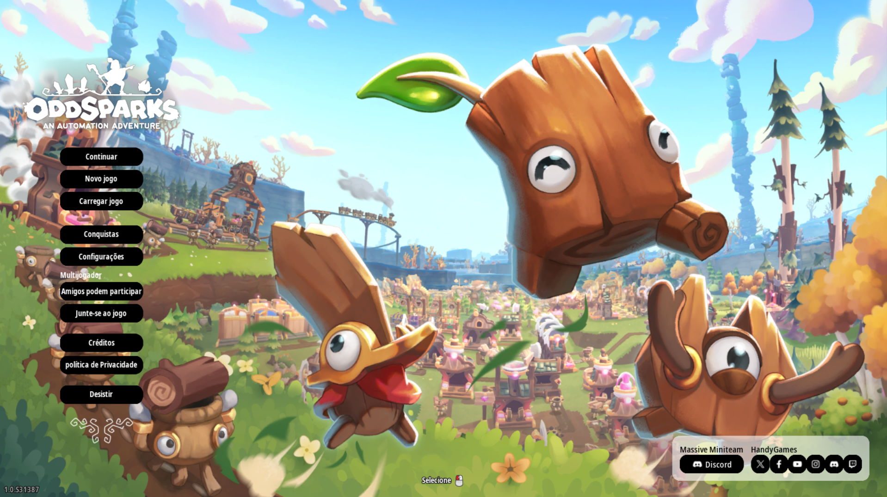
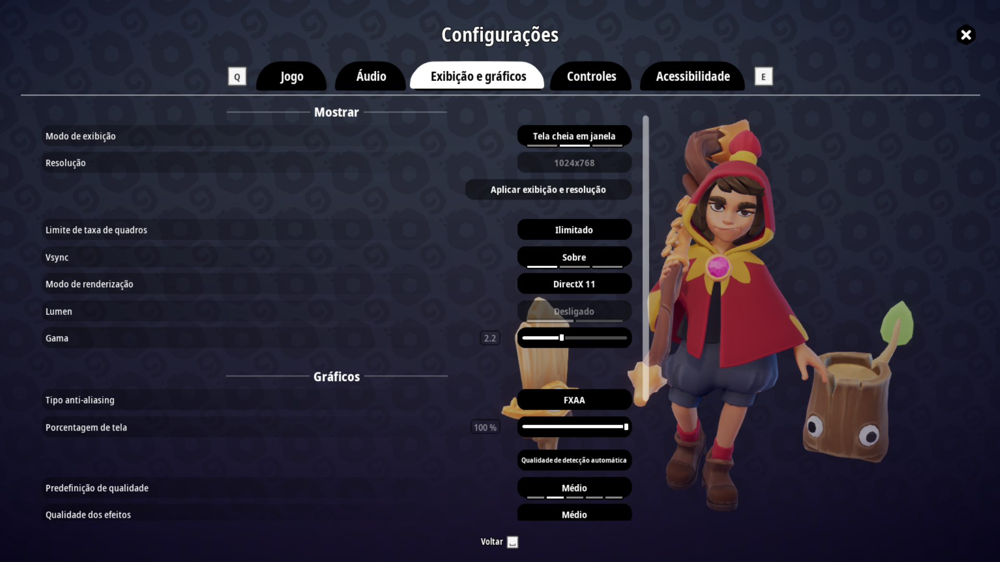
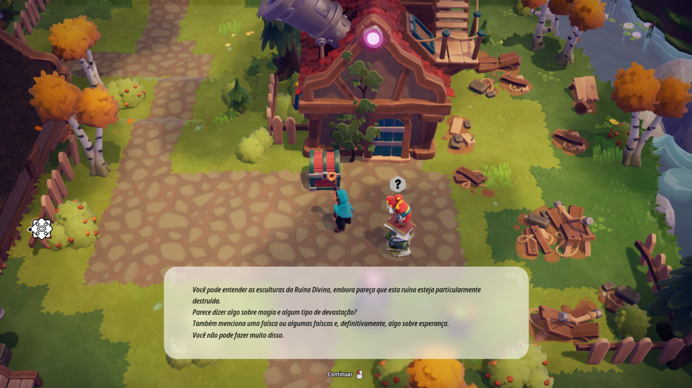
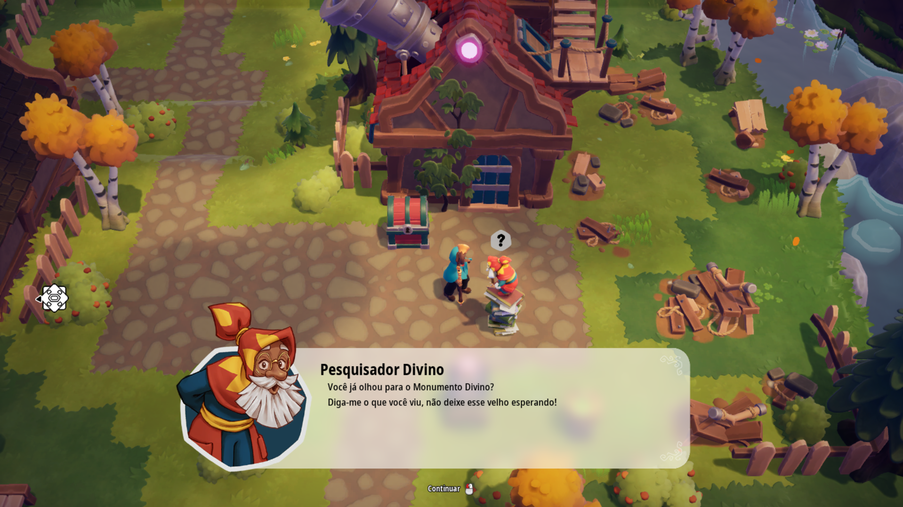
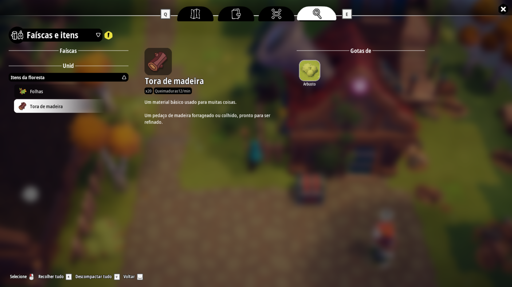

# 🇧🇷 Tradução PT-BR - Oddsparks: An Automation Adventure

Este repositório contém a modificação de tradução para o português brasileiro (PT-BR) do jogo **Oddsparks: An Automation Adventure**. A tradução cobre todos os menus, interfaces, descrições de itens, diálogos e tutoriais, adaptando a experiência de automação e exploração para a nossa comunidade.

O projeto conta com um instalador automatizado universal com suporte nativo para as versões da **Steam** e da **Epic Games Store**.

---

## 🚀 Funcionalidades

* **Tradução Ampla:** Textos do jogo adaptados para o português do Brasil.
* **Preservação do Jogo:** Tradução feita utilizando scripts inteligentes de Regex para garantir que códigos, variáveis internas e formatações de tela (`{0}`, ` `, etc.) permanecessem intactos, evitando bugs ou crashes.
* **Instalador Inteligente:** Detecta automaticamente a arquitetura correta do Windows, direcionando para as pastas padrão de 32-bits (Steam - `Program Files (x86)`) e 64-bits (Epic Games - `Program Files`).
* **Desinstalador Integrado:** Permite reverter o jogo para o inglês original de forma limpa pelo painel de controle do Windows ou pela pasta do mod.

---

## 🛠️ Como Instalar (Método Recomendado)

1. Vá até a aba [Releases](https://github.com) deste repositório e baixe a versão mais recente do arquivo `Instalador_Traducao_Oddsparks_PTBR.exe`.
2. Execute o instalador no seu computador.
3. Na primeira tela, selecione a plataforma onde você possui o jogo (**Steam** ou **Epic Games**).
4. O instalador preencherá automaticamente a pasta padrão. Se o seu jogo estiver em outro HD ou diretório customizado, clique em *Procurar* e selecione a pasta raiz do jogo.
5. Avance e clique em **Instalar**.
6. Pronto! Abra o jogo e aproveite a automação em português!

### 📦 Instalação Manual (Alternativa)
Caso prefira não usar o instalador:
1. Extraia o arquivo `.pak` do mod.
2. Navegue até a pasta de instalação do seu jogo.
3. Vá no caminho: `Oddsparks\Oddsparks\Content\Paks\`
4. Cole o arquivo `.pak` dentro desta pasta `Paks`.

---

### 📺 Veja a Tradução em Ação

*Clique na imagem acima para ver o gameplay traduzido no YouTube.*

### 📸 Galeria de Imagens
| Menu Inicial | Inventário / PDA | Diálogos |
| :---: | :---: | :---: |
|  |  |  | |  | |  |
---

## 👥 Créditos e Ferramentas Utilizadas

* **Tradução e Modding:** XDarksider96
* **Ferramentas de Extração:** FModel & Unreal Locres Editor.
* **Empacotador:** Repak (ferramenta de empacotamento da comunidade).
* **Compilador do Instalador:** Inno Setup Compiler (Pascal Scripting).
* **Motor de Tradução:** Script customizado em Python integrado com API do tradutor com proteção via Expressões Regulares (Regex).

---

## 📄 Licença

Este é um projeto feito por fã, de código aberto e sem fins lucrativos. Todos os direitos de propriedade intelectual do jogo original pertencem à *Massive Miniteam* e *HandyGames*.
